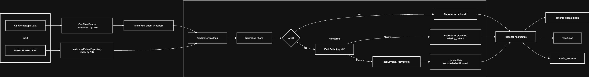

# Phone Update Script Documentation

This document describes the implementation of Part A – the WhatsApp patient phone update script: data flow, assumptions & data‑cleaning rules, edge cases, and how to run it.

---

## 1. High-Level Flow



### Components

- **CsvSheetSource**: Reads CSV header, maps columns, builds `SheetRow[]`, sorts chronologically (oldest → newest) by `last_updated_date` so most recent number wins last.
- **InMemoryPatientRepository**: Indexes patients by NIK identifier (`system === https://fhir.kemkes.go.id/id/nik`). Applies phone changes idempotently (no version bump if unchanged).
- **Phone Normaliser**: Standardises all acceptable inputs while preserving significant digits. Output format is selectable:
	- `e164` → canonical `+62…` (default)
	- `local0` → local format with leading `0…`
- **UpdateService**: Core loop (no date filtering—intentionally processes all rows). Each valid phone row updates the patient telecom (system: `phone`, use: `mobile`).
- **Meta Updater**: On a change, increments `meta.versionId` (`vNNN` style) and regenerates `meta.lastUpdated` with pseudo microseconds and local timezone offset.
- **UpdateReporter**: Tracks counts (total, updated, unchanged, invalid, missing patient) and writes output artifacts.

---

## 2. Data-Cleaning & Normalisation Rules

| Aspect                    | Rule                                                                                                                           | Rationale                                 |
| ------------------------- | ------------------------------------------------------------------------------------------------------------------------------ | ----------------------------------------- |
| Whitespace / punctuation  | Strip spaces, dashes, parentheses before processing                                                                            | Handle user-friendly formatting           |
| Country code handling     | Inputs starting with `+62` kept; starting with `62` converted to `+62`; starting with `0` => `+62` + rest without leading zero | Consistent canonical form                 |
| Local numbers (no prefix) | If starts with an 8 (e.g. `812…`) assume Indonesian mobile => prepend `+62`                                                    | Common shorthand in local data            |
| Invalid characters        | Any non-digit (after removing an optional leading `+`) causes row to be marked invalid                                         | Prevent corrupt phone entries             |
| Length sanity             | Reject clearly too-short numbers (e.g. < 8 digits after normalisation)                                                         | Reduce noise / typos                      |
| Idempotency               | If patient already has the same canonical phone, classify as `validUnchanged` (no version bump)                                | Accurate reporting                        |
| Multiple updates per NIK  | Chronological sort ensures last (newest date) wins                                                                             | Deterministic final state                 |
| Missing patient           | Row recorded as `missing_patient`                                                                                              | Helps audit sheet vs bundle discrepancies |
| Unparsable date           | Treated as epoch baseline (sort position = oldest)                                                                             | Avoid crash / still process data          |
| Meta version bump         | Only on actual change. `vNNN` increments                                                                                       | Maintains semantic version progression    |
| Timestamp precision       | Pseudo microseconds (ms + random 3 digits) with timezone offset                                                                | Human readable + low collision risk       |

---

## 3. Edge Cases Addressed

1. **Duplicate consecutive phones**: Counts as `unchanged`, no extra version bump.
2. **Multiple historical rows out of order in CSV**: Sorting fixes ordering; latest phone applied last.
3. **Rows with blank phone**: Normaliser marks invalid (fails validation) → captured in `invalid_rows.csv`.
4. **Rows with invalid NIK (no matching patient)**: Counted as `missing_patient` (not mixed with formatting issues).
5. **Mixed date delimiters (`/` or `-`)**: Parser supports both `DD-MM-YYYY` and `DD/MM/YYYY`.
6. **Partial patient objects (missing telecom/meta)**: Repository initialises arrays/objects lazily.
7. **Pre-existing telecom entries with different system/use**: Only updates entry where `system === "phone"` and `use === "mobile"`; others untouched.
8. **Unparsable or missing date**: Sorted to the beginning, still processed so no data silently lost.
9. **Already normalised phone**: Still validated, minimal overhead.
10. **JSON bundle extra fields**: Ignored safely due to typed but extensible `PatientResource` interface.

---

## 4. Assumptions

- All patient identification for updates relies solely on the NIK identifier with system `https://fhir.kemkes.go.id/id/nik`.
- Sheet rows represent _state transitions_; replaying all rows (after sorting) is acceptable and desired for determinism.
- No daily filtering: the current iteration intentionally processes every row in the CSV for transparency and simpler testing (can be reintroduced as a filter if needed).
- Only one WhatsApp mobile number is tracked per patient (`telecom` entry with `system: phone`, `use: mobile`). Additional numbers (home/other) are out of scope.
- Timestamp pseudo microsecond precision is acceptable for audit; true microsecond accuracy not required.
- Large dataset performance acceptable in memory for the exercise; streaming or chunked IO can be added later.

---

## 5. Output Artifacts

| File                           | Purpose                                                                                |
| ------------------------------ | -------------------------------------------------------------------------------------- |
| `data/output/patients_updated.json` | Updated patient bundle (array `patients_after_phone_update`)                           |
| `data/output/report.json`           | Summary counts: totalRows, validUpdated, validUnchanged, invalidFormat, missingPatient |
| `data/output/invalid_rows.csv`      | (Optional) Details of invalid or missing patient rows                                  |

---

## 6. Running the Script

### Prerequisites

- Node.js 22.16.0 (tested) / npm
- No external services required (local file processing only)

### Install Dependencies

(This repository already contains dependencies; run once after cloning.)

```
npm install
```

### CLI Usage

```
# Direct mode (non-interactive) — defaults shown below can be omitted
npm run build && node dist/index.js \
	--patients 'data/repo/patients-data.json' \
	--sheet 'data/sheets/Whatsapp Data - Sheet.csv' \
	--outdir 'data/output' \
	--phoneFormat e164

# Interactive mode (prompts for paths and phone format)
npm run interactive
```

If flags are omitted, defaults are:
- patients: `data/repo/patients-data.json`
- sheet: `data/sheets/Whatsapp Data - Sheet.csv`
- outdir: `data/output`
- phoneFormat: `e164`

### Build (TypeScript → JavaScript)

```
npm run build
```

(Outputs to `dist/` per `tsconfig.json`.)

### Run Tests

```
npm test
```

### Example Session (non-interactive)

```
> npm run build
> node dist/index.js --patients data/repo/patients-data.json --sheet "data/sheets/Whatsapp Data - Sheet.csv" --outdir data/output --phoneFormat local0
Update complete. Rows processed: 123, updated: 87, unchanged: 22, invalid format: 9, missing patient: 5
Outputs written to: data/output
```

---

## 7. Extensibility Ideas

| Enhancement                | Description                                                     |
| -------------------------- | --------------------------------------------------------------- |
| Date Filter Reintroduction | Optional `--run-date DD-MM-YYYY` to filter rows to a single day |
| Streaming CSV              | Process large CSVs line-by-line to reduce memory footprint      |
| Parallel FHIR Writes       | Replace with async batched HTTP PUT/PATCH operations            |
| Configurable Normalisation | External JSON/YAML rules for alternate country formats          |
| Metrics & Tracing          | Use and export OpenTelemetry spans                              |

---

## 8. Glossary

- **NIK**: Indonesian national identity number used as primary lookup key.
- **Canonical Phone**: Normalised form beginning with `+62` used for comparison and storage.
- **Idempotent Update**: No change (and no version bump) if the new canonical phone equals the stored one.

---

## 9. Quick Start TL;DR

```
npm run interactive
```

---
