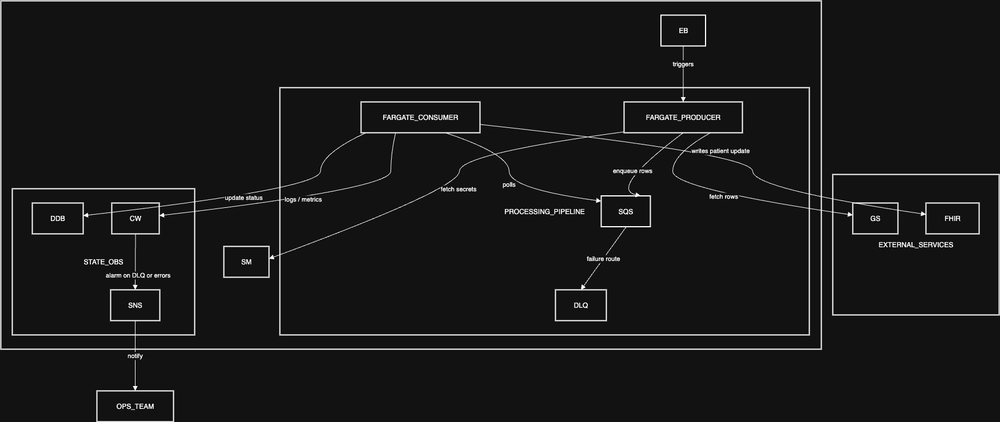
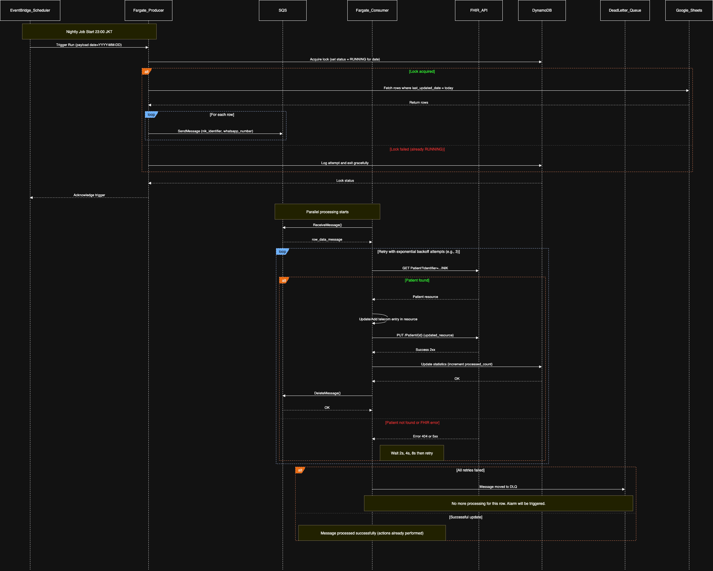

# System Design: Nightly WhatsApp Phone Sync

This document outlines the design for a production-ready, resilient, and scalable platform to synchronize WhatsApp phone numbers from a Google Sheet to a FHIR API. The job is scheduled to run daily at 23:00 (Asia/Jakarta).

## 1. Assumptions and Trade-offs

### Assumptions

- **FHIR API:** The target FHIR service has an accessible RESTful API that can handle a moderate load of concurrent requests (e.g., 10-50 requests per second). We assume the API has an `upsert` (update or insert) capability or a reliable way to check for a patient's existence using a business identifier.
- **Google Sheet:** The source data in Google Sheets is reasonably clean, with a `last_updated_date` column for filtering daily changes and a `nik_identifier` for patient lookups.
- **Environment:** The system will be built on AWS, leveraging managed services to reduce operational overhead. This aligns with your experience with AWS deployments.
- **Data Volume:** The system is designed for an initial load of \~20,000 rows but can scale to handle significantly more.

### Trade-offs

- **Managed Services vs. Self-Hosting:** We are opting for AWS Managed Services (EventBridge, SQS, Fargate, DynamoDB) over self-hosting solutions (e.g., a custom Cron server, RabbitMQ). This increases cost slightly but significantly reduces maintenance, improves reliability, and allows the team to focus on the business logic.
- **Near-Real-Time vs. Batch:** This design is for a nightly batch job. It is not intended for real-time synchronization. A different architecture using Google Sheet webhooks would be required for real time.

## 2. Artefacts

### 2.1. Component Diagram

This diagram shows the main components of the system and their interactions.

**Legend / Abbreviations:**

- **GS:** Google Sheets (The data source).
- **FHIR:** Fast Healthcare Interoperability Resources (The national API destination).
- **EB:** AWS EventBridge (Scheduler for the cron job).
- **SM:** AWS Secrets Manager (Stores API keys securely).
- **Fargate Producer/Consumer:** AWS Fargate Tasks (Serverless containers running the worker application).
- **SQS:** AWS Simple Queue Service (Message queue for individual rows).
- **DLQ:** Dead-Letter Queue (Stores messages that fail processing from SQS).
- **DDB:** AWS DynamoDB (Database for job run tracking and distributed locking).
- **CW:** AWS CloudWatch (Service for logs, metrics, and alarms).
- **SNS:** AWS Simple Notification Service (Service for sending alert notifications).
- **OpsTeam:** The operations team that receives alerts.

### What to Build vs. What to Use

- **To Build:**
  - **Data Ingestion Worker (Node.js/TypeScript):** A containerized application with logic to:
    1. Act as a "Producer" to fetch data from Google Sheets (filtered by `last_updated_date`) and enqueue it.
    2. Act as a "Consumer" to process messages from SQS, perform the search-and-update logic on the FHIR API, and handle data transformation.
    3. Handle retries, error logging, and status updates.
    4. This aligns well with your experience in Node.js, TypeScript, and Docker.

- **Ready to Use (Configure):**
  - **AWS Services:** EventBridge, SQS, ECS on Fargate, DynamoDB, CloudWatch, Secrets Manager, SNS.
  - **Open Source Libraries:** Google API Client for Node.js, Axios (for HTTP requests), and robust logging libraries (e.g., Pino).

### 2.2. Data-Flow Sequence

This sequence diagram illustrates the journey of a single row, including failure and retry paths.

**Legend / Abbreviations:**

- **EB (EventBridge_Scheduler):** The AWS service that triggers the job on a schedule.
- **Producer (Fargate_Producer):** The worker task responsible for fetching data from Google Sheets and adding it to the queue.
- **GS (Google_Sheets):** The source of the patient data.
- **SQS:** The message queue holding individual patient records to be processed.
- **Consumer (Fargate_Consumer):** The worker task responsible for processing records from the queue and updating the FHIR API.
- **FHIR_API:** The national FHIR server that is the destination for the data.
- **DDB (DynamoDB):** The database used for tracking job status and preventing overlaps.
- **DLQ (DeadLetter_Queue):** The queue where records that fail processing are sent.

### 2.3. Operations View

- **Deployment Targets:**
  - **AWS Fargate on ECS:** The worker application will be deployed as a service on Fargate.
  - **Rationale:** This provides a serverless container environment. It scales without managing EC2 instances, integrates seamlessly with SQS and other AWS services, and fits your Docker experience perfectly. We can define one ECS Task Definition for the worker and use it for both the producer and consumer roles.
- **Scaling Rules:**
  - The primary scaling mechanism is for the "Consumer" tasks. We will use **Target Tracking Scaling** based on the `ApproximateNumberOfMessagesVisible` metric from the SQS queue.
  - **Rule Example:** Maintain an average of 100 messages per Fargate task. If the queue depth grows to 500 messages, ECS will automatically scale out to 5 tasks. When the queue is empty, it will scale back in to a minimum number (e.g., 0 or 1).
- **Alerting & Observability Stack:**
  - **Metrics & Logs:** AWS CloudWatch collects logs from Fargate and all service metrics.
  - **Dashboards:** A dedicated CloudWatch Dashboard will be created for operators to get clear visibility of job progress, visualizing:
    - `JobDuration` (Custom Metric)
    - `RecordsProcessed` (Successes) vs. `RecordsFailed` (Failures) (Custom Metrics)
    - SQS Queue Depth (`ApproximateNumberOfMessagesVisible`)
    - DLQ Size (`ApproximateNumberOfMessagesVisible`)
    - Fargate CPU and Memory Utilization
    - FHIR API Latency & Error Rate (from logs or custom metrics)
  - **Alarms:** CloudWatch Alarms will be configured for:
    - **P1 (Critical Failures):**
      - Any message in the DLQ (`DLQ Size > 0`).
      - Job `status` remains "RUNNING" for more than 1 hour.
      - High rate of 5xx errors from the FHIR API.
      - _Action:_ Trigger SNS topic that routes to a team Slack channel / Telegram.
    - **P2 (Medium Severity):**
      - Job `status` is "FAILED".
      - Fargate service has 0 running tasks during an active job.
      - _Action:_ Trigger SNS topic that routes to a team Slack channel / Telegram.
- **Operator Interfaces (Manual Re-runs):**
  - A simple AWS Lambda function will be created, invokable via the AWS Console.
  - **Functionality:** The Lambda function accepts a JSON payload like `{ "date": "2025-09-25" }`. It then starts an ECS Task for the "Producer" role with this date as an environment variable override. This allows an operator to easily rerun the job for a given date if needed.

## 3. In-Depth Explanations

#### How is the job triggered and how are overlaps prevented?

- **Trigger:** An **AWS EventBridge Scheduler** rule is configured with a cron expression `cron(0 16 * * ? *)`, which translates to 16:00 UTC, or 23:00 Asia/Jakarta (UTC+7).
- **Ingestion Logic:** The "Producer" task is triggered with the current date. It queries the Google Sheets API to ingest only those rows where the `last_updated_date` column matches this date.
- **Overlap Prevention:** We use a **DynamoDB table as a distributed lock**.
  1. The table's primary key is the `executionDate` (e.g., "2025-09-25").
  2. When a job starts, it performs a conditional `PutItem` to create an entry for that date with `status: "RUNNING"`, but only if no item for that date exists.
  3. If the write succeeds, the job has the lock. If it fails, the job logs the overlap attempt and exits gracefully.
  4. Upon completion, the job updates the item to `status: "SUCCESS"` or `status: "FAILED"`.

#### How do you achieve performance of ≥20k rows in 30 minutes?

The target of \~11 rows/second is met through **decoupling and parallelism**. The two-step FHIR interaction (search then update) increases the time taken per row, making this architecture crucial.

1. **Fast Ingestion:** The "Producer" task reads all relevant daily rows from Google Sheets (a filtered query) and rapidly pushes them to an SQS queue. This decouples ingestion from processing.
2. **Parallel Processing:** The "Consumer" Fargate tasks scale based on queue depth. With 10 tasks running, the system processes 10 patient records in parallel, each performing its search-and-update flow independently. This parallelism is key to absorbing the per-record latency and meeting the 30-minute goal.

#### How are idempotency, retries, and failures handled?

- **FHIR Update Logic:** The worker logic is inherently idempotent due to the specific FHIR workflow:
  1. **Search:** It first calls `GET Patient?identifier=...|<NIK>` to fetch the existing Patient resource.
  2. **Transform:** In memory, it finds the `telecom` array. It either updates the existing entry where `system` is `phone` and `use` is `mobile`, or it adds a new entry if one doesn't exist.
  3. **Update:** It sends the entire modified Patient resource back via a `PUT` request to the patient-specific endpoint (e.g., `PUT /Patient/<patient_id>`). A `PUT` replaces the entire resource, ensuring the final state is correct even if the message is processed multiple times.

- **Retry/Backoff:** For transient network errors or 5xx responses from the FHIR API, the worker code will implement an **exponential backoff and jitter** retry strategy for the entire search-and-update sequence.
- **Partial Failures & Outages:** If a row fails consistently (e.g., an invalid NIK causing a 404 from the FHIR search), it will be moved to the **Dead-Letter Queue (DLQ)** after several failed attempts. This isolates the single failed message, allowing all other valid rows to be processed successfully and triggering a critical alert for investigation.

#### How are configuration and credentials managed?

- **No Hardcoded Secrets:** All secrets—the **Google Sheets service account JSON key** and the **FHIR x-api-key**—will be stored in **AWS Secrets Manager**.
- **IAM Roles:** The Fargate Task will be assigned an IAM Role with least-privilege permissions to read these specific secrets, interact with the SQS queue and DynamoDB table, and write logs.
- **Secret Rotation:** We will configure automated rotation policies in AWS Secrets Manager. For the `x-api-key`, this can trigger a Lambda function to call the FHIR service's key rotation endpoint. For the Google service account, the rotation policy can prompt an administrator to upload a new key.

#### How is the system monitored?

- **Signals Collected:**
  - **Business Metrics (Custom CloudWatch Metrics):** The worker explicitly publishes metrics like `RecordsProcessed`, `RecordsFailed`, and `JobDuration` to provide clear visibility on progress and outcomes.
  - **Infrastructure Metrics:** CloudWatch automatically collects metrics on Fargate CPU/Memory and SQS queue depth.
  - **Application Logs:** The application will use structured JSON logging, with each log entry including a `jobId` and `nik_identifier` for easy tracing of a single record's journey.
- **Surfacing to the Team:**
  - **Dashboards:** A central CloudWatch Dashboard provides at-a-glance visibility for operators.
  - **Alerts:** Critical failures (e.g., messages in DLQ) trigger PagerDuty via an SNS topic. Other warnings post to a team Slack channel.

#### What is the disaster recovery/replay approach?

- **Replayability:** The system is inherently replayable. The manual trigger mechanism (the operator-invoked Lambda) allows rerunning the job for any past date.
- **Failure Recovery:**
  - **Mid-run Failure:** SQS messages are durable. If Fargate tasks crash, they will restart and continue processing messages from the queue. The DynamoDB lock prevents a conflicting run from starting.
  - **DLQ Processing:** Messages in the DLQ can be inspected. Once the root cause is fixed, SQS's "redrive" feature moves messages back to the main queue for reprocessing.

## 4. Future Enhancements

- **Workflow Orchestration:** For more complex logic, replace the EventBridge trigger with **AWS Step Functions**. This provides a visual workflow, better state management, and more granular error handling.
- **Data Validation Stage:** Introduce a formal validation step (e.g., a Lambda function) that checks the format of the NIK and phone number before enqueueing to SQS, allowing for earlier failure detection.
- **Automated CI/CD:** Implement a full CI/CD pipeline using AWS CodePipeline or GitHub Actions to automate testing, building the Docker image, and deploying new versions of the Fargate service.
